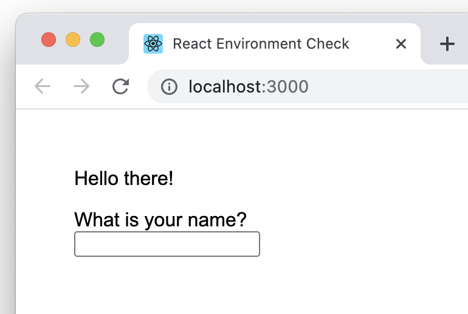

# React Environment Check
This projects does nothing but checking that you have an environment ready to write React.

To begin the development checkout this project and then
- run `npm install` or `yarn install`, 
- run `npm start` or `yarn start`.

Then you should see image below:

